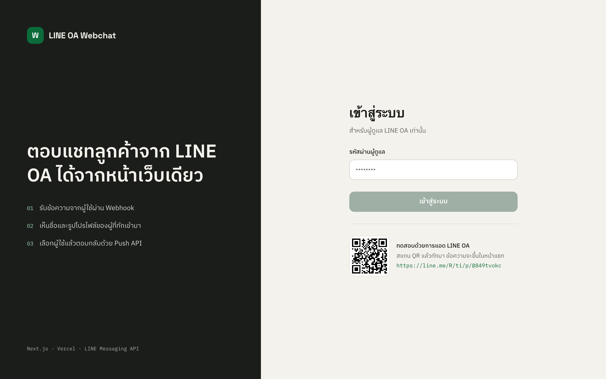
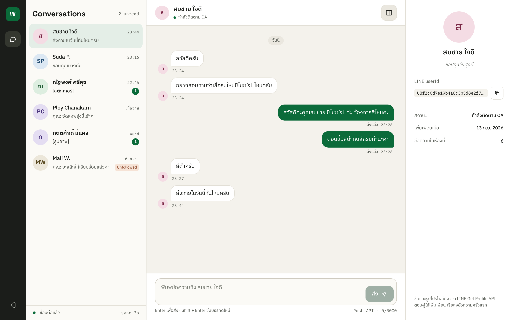
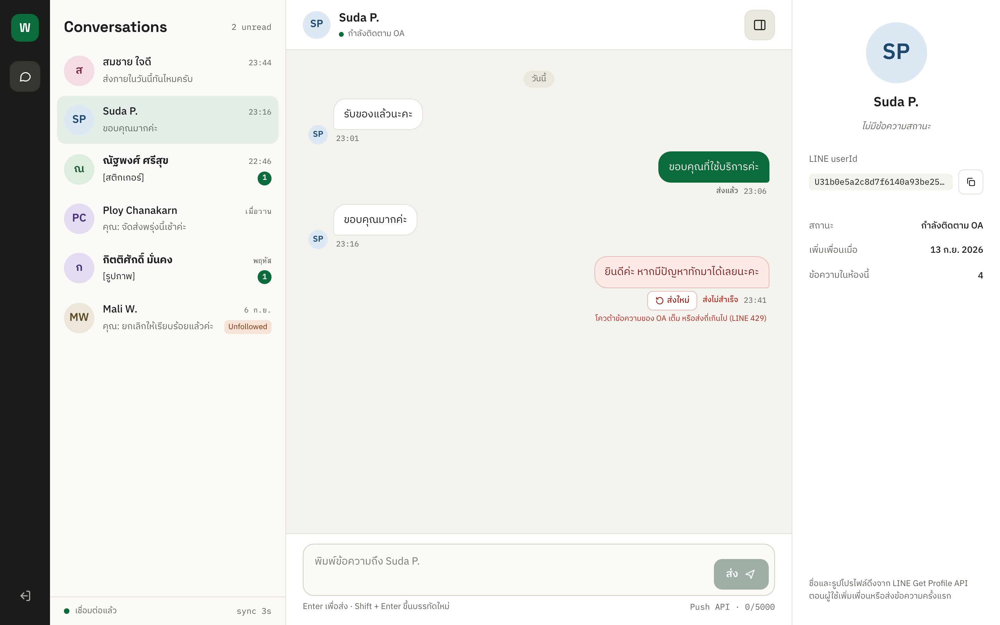
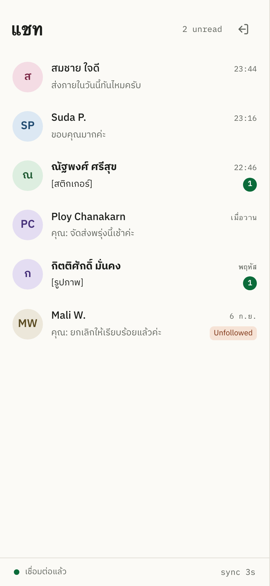
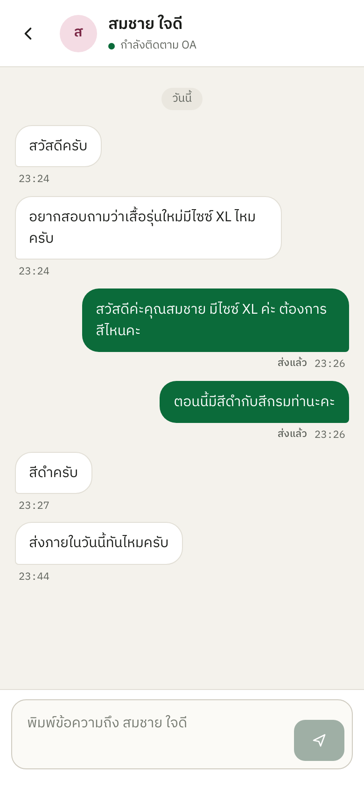
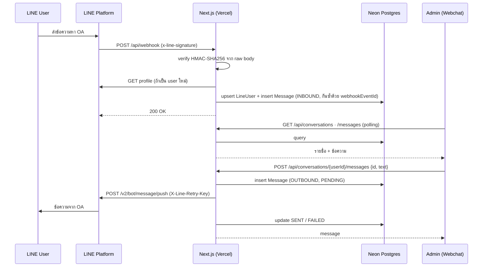

# LINE OA Webchat

Webchat console สำหรับ LINE Official Account — รับข้อความจากผู้ใช้ผ่าน **Webhook** เห็นว่าใครทักมา (ชื่อ/รูปจาก Get Profile API) แล้วเลือกผู้ใช้เพื่อตอบกลับด้วย **Push API** ได้จากหน้าเว็บเดียว

สร้างด้วย Next.js 16 (App Router) + TypeScript + Prisma + Neon Postgres, deploy บน Vercel

## ลิงก์สำหรับตรวจ

| | |
|---|---|
| **LINE OA** | https://line.me/R/ti/p/@849tvokc (Basic ID `@849tvokc`) |
| **Webchat** | `https://<project>.vercel.app` |
| **รหัสผ่านทดสอบ** | ส่งแยกให้ผู้ตรวจ (ไม่อยู่ใน repo) |


**วิธีลองเร็ว ๆ:** สแกน QR แอด OA เป็นเพื่อน → พิมพ์ข้อความหา OA → เปิด Webchat แล้ว login → เห็นห้องแชทของคุณขึ้นภายในไม่กี่วินาที → เลือกห้องแล้วตอบกลับ ข้อความจะเด้งใน LINE ของคุณ

## Screenshots

> ภาพด้านล่างใช้ข้อมูลตัวอย่างเพื่อแสดงหน้าตา UI (ไม่ใช่ข้อมูลผู้ใช้จริง)

| Login | Console (desktop) |
|---|---|
|  |  |

| ส่งไม่สำเร็จ + ส่งใหม่ | Mobile |
|---|---|
|  |   |

## ความสามารถ

- รับข้อความ (text, sticker, image, ประเภทอื่นแสดงเป็นป้ายกำกับ) พร้อมโปรไฟล์ผู้ใช้ และรับเหตุการณ์ follow / unfollow
- รายชื่อแชทเรียงตามข้อความล่าสุด มี unread badge, สถานะเลิกติดตาม และ mark as read เมื่อเปิดห้อง
- ตอบกลับด้วย Push API — สถานะ `PENDING → SENT / FAILED` บันทึกใน DB, ข้อความที่ส่งไม่สำเร็จกด **ส่งใหม่** ได้โดยไม่เกิดข้อความซ้ำ
- ประวัติแชทแบบ cursor pagination + ปุ่ม "โหลดข้อความเก่ากว่า"
- Polling (รายชื่อทุก 3 วินาที, ห้องที่เปิดทุก 2 วินาที) และหยุดเมื่อสลับแท็บ
- ป้องกันหน้า console ด้วยรหัสผ่าน (signed session cookie) — `/api/webhook` เป็นเส้นทางเดียวที่เปิดสาธารณะ และยืนยันตัวตนด้วย signature ของ LINE
- Responsive: มือถือแยกหน้ารายชื่อกับห้องแชท

## Architecture



**ข้อตัดสินใจหลัก**

| เรื่อง | ทำอย่างไร | เหตุผล |
|---|---|---|
| ตรวจ signature | อ่าน raw body ด้วย `req.text()` ก่อน แล้วค่อย `JSON.parse` | signature คำนวณจากทุก byte ของ body ถ้า parse แล้ว stringify กลับจะไม่ตรง |
| กัน webhook ซ้ำ | `createMany({ skipDuplicates })` บน `webhookEventId` (unique) | LINE redeliver ได้ และอาจซ้อนกันหลาย request; `ON CONFLICT DO NOTHING` ปลอดภัยกว่า check-then-insert |
| ส่งข้อความ | client สร้าง `id` (UUID) ส่งมากับ `POST`; ส่ง `id` เดิมซ้ำ = ส่งใหม่ทับแถวเดิม | idempotent — กดซ้ำ/เน็ตหลุดก็ไม่เกิดแถวซ้ำ และ server "จอง" แถวด้วย compare-and-set กันส่งซ้อน |
| `X-Line-Retry-Key` | คำนวณจาก message id (คงที่ทุกครั้ง) | ถ้า LINE รับคำขอแรกไปแล้วแต่เราไม่ได้รับผลตอบกลับ การส่งใหม่จะได้ `409` (ถือว่าสำเร็จ) ไม่เด้งซ้ำในมือถือลูกค้า |
| PENDING ค้าง | แสดงเป็น FAILED เมื่อค้างเกิน 60 วินาที | กัน function ตายกลางทางแล้วบับเบิลค้าง "กำลังส่ง…" ตลอดไป |
| Realtime | polling ด้วย TanStack Query | Vercel ไม่รองรับ WebSocket server แบบ long-lived — อัปเกรดเป็น Pusher/Ably ได้ภายหลัง |
| Prisma บน serverless | driver adapter `pg` + Neon **pooled** URL, migrate ผ่าน unpooled URL | จำกัดจำนวน connection ตอน scale |

โครงโฟลเดอร์และรายละเอียดเพิ่มเติม: [docs/implementation-plan.md](docs/implementation-plan.md) · แผน UI: [docs/ui-implementation-plan.md](docs/ui-implementation-plan.md)

## API

| Method | Path | หน้าที่ | Auth |
|---|---|---|---|
| `POST` | `/api/webhook` | รับ event จาก LINE | `x-line-signature` |
| `GET` | `/api/conversations` | รายชื่อแชท | session |
| `GET` | `/api/conversations/[userId]/messages?cursor=&limit=` | ประวัติแชท (ล่าสุดก่อน, `nextCursor` สำหรับหน้าที่เก่ากว่า) | session |
| `POST` | `/api/conversations/[userId]/messages` | ส่งข้อความ / ส่งใหม่ `{ id, text }` | session |
| `POST` | `/api/conversations/[userId]/read` | เคลียร์ unread | session |
| `POST` | `/api/auth/login` · `/api/auth/logout` | เข้า/ออกจากระบบ | — |

## Environment variables

| ตัวแปร | ใช้ทำอะไร | ได้จากไหน |
|---|---|---|
| `LINE_CHANNEL_SECRET` | ตรวจ signature ของ webhook | LINE Developers Console → Basic settings |
| `LINE_CHANNEL_ACCESS_TOKEN` | เรียก Push / Get Profile API | LINE Developers Console → Messaging API → Channel access token (long-lived) |
| `NEXT_PUBLIC_LINE_OA_URL` | ลิงก์แอดเพื่อนและ QR ในหน้า login / empty state | `https://line.me/R/ti/p/@<basic-id>` — **ต้องมีตอน build** (Next ฝังค่าลง bundle) |
| `DATABASE_URL` | connection ตอนรันแอป | Neon **pooled** connection (host มี `-pooler`) |
| `DIRECT_URL` | connection ตอน migrate | Neon direct connection — ถ้าไม่ตั้ง จะใช้ `DATABASE_URL_UNPOOLED` (Neon integration บน Vercel ใส่ให้) แล้วค่อย fallback เป็น `DATABASE_URL` |
| `ADMIN_PASSWORD` | รหัสผ่าน login console | ตั้งเอง |
| `SESSION_SECRET` | เซ็น session cookie (≥ 32 ตัวอักษร) | `openssl rand -base64 48` |

ตัวอย่างอยู่ที่ [.env.example](.env.example) ค่าจริงเก็บใน `.env.local` และ Vercel Project Settings เท่านั้น

## ตั้งค่าและ deploy

### 1) LINE

1. สร้าง LINE Official Account ที่ [LINE Official Account Manager](https://manager.line.biz/)
2. Settings → Messaging API → **Enable** (จะสร้าง channel ใน LINE Developers Console ให้)
3. LINE Developers Console → เก็บ **Channel secret** และออก **Channel access token (long-lived)**
4. OA Manager → Response settings: เปิด **Webhook**, ปิด **Auto-response** และ **Greeting message** (กันข้อความอัตโนมัติปนกับของ admin)
5. เก็บลิงก์แอดเพื่อน `https://line.me/R/ti/p/@<basic-id>` ไปใส่ `NEXT_PUBLIC_LINE_OA_URL`

### 2) Neon + Vercel

1. Import repo ที่ Vercel (Framework: Next.js) — Build command ตั้งไว้ใน [vercel.json](vercel.json) แล้ว: `prisma migrate deploy && next build` (`prisma generate` รันจาก `postinstall`)
2. Storage → เพิ่ม **Neon Postgres** เลือก region ใกล้ผู้ใช้ (เช่น Singapore) และตั้ง Function Region ของ Vercel ให้ตรงกัน เพื่อไม่ให้ทุก query ข้ามทวีป integration จะ inject `DATABASE_URL` และ `DATABASE_URL_UNPOOLED` ให้
3. ใส่ env ที่เหลือตามตารางด้านบน (อย่าตั้ง `NODE_ENV`)
4. Deploy — migration จะรันตอน build

> Neon integration อาจใช้ database เดียวกันทุก environment ถ้า Preview deployment ที่มี migration ใหม่ build ก่อน merge มันจะ migrate database เดียวกับ production เพราะ build command รัน `migrate deploy` — ถ้าไม่ต้องการ ให้แยก database (Neon branch) ต่อ environment

### 3) ตั้ง Webhook

LINE Developers Console → Messaging API → Webhook URL = `https://<project>.vercel.app/api/webhook` → กด **Verify** (ต้องขึ้น Success) → เปิด **Use webhook**

> ใช้ **Production domain** — Preview deployment มักเปิด Deployment Protection ทำให้ LINE ยิงเข้าไม่ได้

### 4) รันในเครื่อง

```bash
cp .env.example .env.local     # แล้วใส่ค่า
npm install                    # postinstall จะ generate Prisma client
npm run db:deploy              # apply migration ไปที่ Neon
npm run dev                    # http://localhost:3000
```

ทดสอบ webhook ในเครื่อง: `ngrok http 3000` แล้วตั้ง Webhook URL ชั่วคราวเป็น URL ของ ngrok (`/api/webhook`) — ทั้ง local และ Vercel เขียนลง Neon เดียวกันถ้าใช้ `DATABASE_URL` เดียวกัน

Scripts: `npm run lint` · `npm run typecheck` · `npm run build` · `npm run format` · `npm run db:migrate` (สร้าง migration ใหม่) · `npm run db:deploy` · `npm run db:studio`

## การทดสอบ

CI ([.github/workflows/ci.yml](.github/workflows/ci.yml)) รันทุก PR และทุก push เข้า `main`: lint → typecheck → `npm audit` (ระดับ critical) → build

ทดสอบด้วยมือตามตารางนี้:

| # | Scenario | ผลที่คาดหวัง |
|---|---|---|
| 1 | กด Verify webhook ใน LINE Console | Success (200) |
| 2 | POST `/api/webhook` ด้วย signature ผิด หรือไม่มี signature | 401 และไม่บันทึกอะไร |
| 3 | user ใหม่แอดเพื่อน / ทักครั้งแรก | ปรากฏในรายชื่อพร้อมชื่อและรูปโปรไฟล์ |
| 4 | user ส่งข้อความ | ขึ้นในห้องภายใน ~3 วินาที, unread +1 |
| 5 | webhook redelivery event เดิม | ไม่เกิดข้อความซ้ำ |
| 6 | 2 user ทักพร้อมกัน | แยกห้องถูกต้อง เรียงตามล่าสุด |
| 7 | admin เลือกห้องแล้วส่งข้อความ | เด้งใน LINE ของ user คนนั้นเท่านั้น สถานะ "ส่งแล้ว" |
| 8 | ส่งให้ user ที่ block OA / เกินโควต้า | สถานะ "ส่งไม่สำเร็จ" + เหตุผล กด "ส่งใหม่" ได้ |
| 9 | เข้า `/chat` โดยยังไม่ login | redirect ไป `/login` |
| 10 | เปิดบนมือถือ | รายชื่อกับห้องแชทแยกหน้า ใช้งานได้ |
| 11 | ห้องที่มีข้อความมากกว่า 30 | กด "โหลดข้อความเก่ากว่า" แล้วหน้าจอไม่กระโดด ไม่มีข้อความซ้ำ/ตกหล่น |

**สถานะการทดสอบ (ตรงไปตรงมา):** ยังไม่มี automated unit test ในโค้ด (แผนอยู่ใน Phase 4) — เส้นทาง webhook (signature ถูก/ผิด, body ถูกแก้, events ว่าง, redelivery, text/sticker/unfollow) และ API (pagination, ส่ง/ส่งใหม่/ส่งพร้อมกัน, PENDING ค้าง, สิทธิ์ข้ามห้อง) ผ่านการทดสอบด้วยสคริปต์ยิง request จริงกับ Neon แล้ว แต่สคริปต์เหล่านั้นไม่ได้อยู่ใน repo

## ข้อจำกัดที่ทราบ

- รองรับแชท 1:1 และส่งได้เฉพาะข้อความ text (ยังไม่แสดงรูป/sticker จริง, ยังไม่ส่ง sticker/รูป)
- Push API นับโควต้าข้อความของแพ็กเกจ OA — เมื่อเต็มจะขึ้นสถานะ "ส่งไม่สำเร็จ" พร้อมเหตุผล
- ผู้ดูแลคนเดียว (รหัสผ่านเดียวจาก env)
- Polling ไม่ใช่ realtime และ refetch ทุกหน้าที่โหลดไว้ในห้องที่เปิดอยู่
- รายชื่อแชทยังไม่จำกัดจำนวนและยังไม่มีช่องค้นหา
- `npm audit` พบช่องโหว่ระดับ high ใน dependency ของ Prisma CLI (`mysql2`, `deepmerge-ts`) ซึ่งรันตอน build เท่านั้น ยังไม่มีทางแก้นอกจาก downgrade เป็น Prisma 6 จึงตั้ง gate ของ CI ไว้ที่ critical

## เทคโนโลยี

Next.js 16 (App Router, `proxy.ts`) · React 19 · TypeScript (strict) · Tailwind CSS v4 · TanStack Query · Zustand · Zod · Prisma 7 + `@prisma/adapter-pg` · Neon Postgres · `@line/bot-sdk` · Vercel
