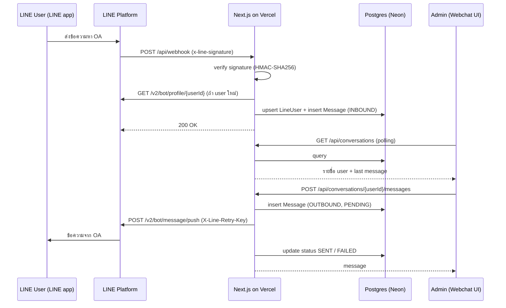

# PLAN — LINE OA Webchat (Next.js + TypeScript)

> แบบทดสอบ: สร้าง webchat ที่ส่งและรับข้อความกับ LINE Official Account ได้ เห็นว่าผู้ใช้คนไหนส่งมา และเลือกผู้ใช้เพื่อตอบกลับได้
> Deploy บน Vercel, source code อยู่บน GitHub (public)

---

## 1. Scope & Assumptions

**ตีความ requirement**

LINE Messaging API ไม่มี endpoint ให้ "คนภายนอก" ส่งข้อความเข้า OA แทน user ได้ ดังนั้น webchat นี้จะทำหน้าที่เป็น **Agent Console** (คล้ายหน้าแชทใน LINE OA Manager):

| Requirement | วิธีทำ |
|---|---|
| ส่งข้อความเข้า LINE OA | User แอด OA เป็นเพื่อนแล้วพิมพ์ใน LINE → LINE ยิง **Webhook** มาที่ `/api/webhook` → บันทึกลง DB → แสดงใน webchat |
| รับข้อความที่ส่งจาก LINE OA | Admin พิมพ์ใน webchat → เรียก **Push Message API** ในนาม OA → ข้อความเด้งใน LINE ของ user และแสดงใน webchat |
| เห็นว่า user คือใคร / เลือกตอบกลับ | ดึง **Get Profile API** (displayName, pictureUrl) → sidebar รายชื่อ user → คลิกเพื่อเปิดห้องแชทและตอบกลับ |

**Out of scope (ทำเป็น bonus ถ้ามีเวลา)**: รูปภาพ/ไฟล์, realtime push, multi-agent, rich message

---

## 2. Architecture



**ข้อจำกัดของ Vercel ที่ต้องออกแบบรองรับ**

- Serverless function ไม่มี state ถาวร → **ต้องมี DB** (เก็บใน memory ไม่ได้)
- ไม่รองรับ WebSocket server แบบ long-lived → เริ่มด้วย **polling** แล้วค่อยอัปเกรดเป็น Pusher/Ably/Supabase Realtime (bonus)

---

## 3. Tech Stack

| Layer | Choice | เหตุผล |
|---|---|---|
| Framework | Next.js (App Router, latest stable) + TypeScript (strict) | ตามโจทย์ |
| UI | Tailwind CSS + shadcn/ui | เร็ว, หน้าตาดี |
| Data fetching | TanStack Query (`refetchInterval`) | polling + optimistic update ง่าย |
| Client state | Zustand (selected user, draft) | เบา |
| Validation | Zod | validate request body / env |
| DB | Neon Postgres (Vercel Marketplace, free tier) | serverless-friendly, มี pooled connection |
| ORM | Prisma | คุ้นมือ |
| LINE | `@line/bot-sdk` (`messagingApi.MessagingApiClient`, `validateSignature`) | official SDK |
| Auth (console) | Password เดียวจาก env + signed cookie + `proxy.ts` / `middleware.ts` | กันคนนอกเห็นแชทของ user |
| Test | Jest + Testing Library | unit test signature / webhook handler |
| Hosting | Vercel (Production domain) | ตามโจทย์ |

---

## 4. Data Model (Prisma)

```prisma
enum Direction { INBOUND OUTBOUND }
enum MessageStatus { PENDING SENT FAILED }

model LineUser {
  id             String    @id            // LINE userId (Uxxxxxxxx)
  displayName    String
  pictureUrl     String?
  statusMessage  String?
  isFollowing    Boolean   @default(true)
  unreadCount    Int       @default(0)
  lastMessageAt  DateTime?
  lastMessage    String?
  createdAt      DateTime  @default(now())
  updatedAt      DateTime  @updatedAt
  messages       Message[]

  @@index([lastMessageAt])
}

model Message {
  id              String        @id @default(cuid())
  lineUserId      String
  lineUser        LineUser      @relation(fields: [lineUserId], references: [id])
  direction       Direction
  type            String        // text | sticker | image | unsupported
  text            String?
  payload         Json?         // raw message object (sticker id ฯลฯ)
  lineMessageId   String?       @unique
  webhookEventId  String?       @unique // กัน webhook redelivery ซ้ำ
  status          MessageStatus @default(SENT)
  error           String?
  sentAt          DateTime      @default(now())

  @@index([lineUserId, sentAt])
}
```

---

## 5. API Design (Route Handlers)

| Method | Path | หน้าที่ |
|---|---|---|
| `POST` | `/api/webhook` | รับ event จาก LINE (public, verify signature) |
| `GET` | `/api/conversations` | รายชื่อ user เรียงตาม `lastMessageAt desc` |
| `GET` | `/api/conversations/[userId]/messages?cursor=` | ประวัติแชท (cursor pagination) |
| `POST` | `/api/conversations/[userId]/messages` | ส่งข้อความ `{ text }` → push |
| `POST` | `/api/conversations/[userId]/read` | reset `unreadCount` |
| `POST` | `/api/auth/login` · `/api/auth/logout` | login console |

### Webhook handler logic

1. `export const runtime = 'nodejs'`, `dynamic = 'force-dynamic'`
2. อ่าน **raw body** ด้วย `await req.text()` (ห้าม `req.json()` ก่อน verify)
3. `validateSignature(body, CHANNEL_SECRET, req.headers.get('x-line-signature'))` → ไม่ผ่านตอบ `401`
4. `events` ว่าง (กรณีกด Verify ใน console) → ตอบ `200`
5. วนแต่ละ event:
   - `follow` → get profile → upsert user, `isFollowing = true`
   - `unfollow` → `isFollowing = false`
   - `message` → upsert user (ดึง profile ถ้ายังไม่มี) → insert Message โดยใช้ `webhookEventId` กันซ้ำ → `unreadCount + 1`, อัปเดต `lastMessage`
   - text เก็บ `text`, sticker เก็บ `packageId/stickerId`, อื่นๆ เก็บเป็น `unsupported`
6. ตอบ `200` ให้เร็วที่สุด (error ราย event ให้ log แต่ไม่ throw ทั้ง request)

### Send message logic

1. Zod validate `text` (1–5000 chars)
2. เช็คว่า user มีอยู่และ `isFollowing`
3. insert Message `PENDING`
4. `pushMessage({ to, messages: [{ type: 'text', text }] }, retryKey)` — ใช้ UUID เป็น `X-Line-Retry-Key` กันส่งซ้ำตอน retry
5. สำเร็จ → `SENT` / ล้มเหลว → `FAILED` + เก็บ error (เช่น quota เต็ม, user block)

> หมายเหตุ: reply token ใช้ได้ครั้งเดียวและอายุสั้น ไม่เหมาะกับการที่ admin ตอบทีหลัง จึงใช้ **push** เป็นหลัก (push นับโควต้าข้อความของแพ็กเกจ OA — เช็คโควต้าใน OA Manager)

---

## 6. UI

```
┌────────────────────────────────────────────────────────────┐
│  LINE OA Webchat                               [Logout]    │
├──────────────────────┬─────────────────────────────────────┤
│ 🔍 Search user        │  (avatar) Somchai        ● following │
│──────────────────────│─────────────────────────────────────│
│ (●) Somchai    10:32 │            สวัสดีครับ  [10:30]        │
│     สวัสดีครับ    (2) │  [10:31] สวัสดีค่ะ มีอะไรให้ช่วยคะ     │
│ ( ) Suda       09:10 │            สอบถามสินค้า  [10:32]      │
│     ขอบคุณค่ะ         │                                     │
│                      │─────────────────────────────────────│
│                      │ [ พิมพ์ข้อความ...           ] [Send] │
└──────────────────────┴─────────────────────────────────────┘
```

- Route: `/chat` (sidebar + empty state), `/chat/[userId]` (เลือก user ผ่าน URL → share/refresh ได้)
- Sidebar: avatar, displayName, last message, เวลา, unread badge, สถานะ unfollow
- Chat pane: bubble ซ้าย (inbound) / ขวา (outbound), status PENDING/FAILED + ปุ่ม retry, auto-scroll, load more
- Input: Enter ส่ง, Shift+Enter ขึ้นบรรทัด, disable ตอนกำลังส่ง
- Polling: conversations ทุก 3s, messages ของห้องที่เปิดทุก 2s
- Responsive: mobile แสดง sidebar กับห้องแชทแยกหน้า
- State: loading skeleton, empty state ("ยังไม่มีข้อความ — แอด OA แล้วทักมาได้เลย" + QR code)

---

## 7. Folder Structure

```
src/
├─ app/
│  ├─ (auth)/login/page.tsx
│  ├─ chat/
│  │  ├─ layout.tsx               # sidebar
│  │  ├─ page.tsx                 # empty state
│  │  └─ [userId]/page.tsx        # chat room
│  └─ api/
│     ├─ webhook/route.ts
│     ├─ auth/{login,logout}/route.ts
│     └─ conversations/
│        ├─ route.ts
│        └─ [userId]/{messages,read}/route.ts
├─ components/chat/               # ConversationList, MessageList, MessageBubble, Composer
├─ hooks/                         # useConversations, useMessages, useSendMessage
├─ lib/
│  ├─ env.ts                      # Zod-validated env
│  ├─ prisma.ts                   # singleton client
│  ├─ line/client.ts              # MessagingApiClient
│  ├─ line/webhook-handler.ts     # pure logic (test ได้)
│  └─ auth.ts                     # sign/verify session cookie
├─ stores/chat-store.ts
└─ proxy.ts                       # protect /chat และ /api/conversations (Next <16 ใช้ middleware.ts)
prisma/schema.prisma
__tests__/
```

---

## 8. Environment Variables

```bash
LINE_CHANNEL_SECRET=
LINE_CHANNEL_ACCESS_TOKEN=     # long-lived token
DATABASE_URL=                  # Neon pooled connection
DIRECT_URL=                    # Neon direct (สำหรับ migrate)
ADMIN_PASSWORD=
SESSION_SECRET=                # random 32+ chars
NEXT_PUBLIC_LINE_OA_URL=       # https://line.me/R/ti/p/@xxxx (แสดงใน empty state)
```

มี `.env.example` ใน repo, ค่าจริงใส่ใน Vercel Project Settings เท่านั้น

---

## 9. Setup Steps

### 9.1 LINE
1. สร้าง LINE Official Account ที่ LINE Official Account Manager
2. Settings → Messaging API → **Enable** (จะสร้าง channel ใน LINE Developers Console ให้)
3. LINE Developers Console → เก็บ **Channel secret**, ออก **Channel access token (long-lived)**
4. OA Manager → Response settings: เปิด **Webhook**, ปิด **Auto-response** และ **Greeting message** (กันข้อความ auto ปนกับของ admin)
5. หลัง deploy: ตั้ง Webhook URL = `https://<project>.vercel.app/api/webhook` → กด **Verify** → เปิด **Use webhook**
6. เก็บ Basic ID / QR / ลิงก์ add friend สำหรับส่งงาน

### 9.2 GitHub
1. สร้าง public repo `line-oa-webchat`
2. `README.md`: overview, architecture, setup, env, วิธีทดสอบ, ลิงก์ส่งงาน
3. commit ตาม Conventional Commits

### 9.3 Vercel
1. Import repo → Framework: Next.js
2. Storage → เพิ่ม Neon Postgres (inject `DATABASE_URL` อัตโนมัติ)
3. ใส่ env ที่เหลือ
4. Build command: `prisma generate && prisma migrate deploy && next build`
5. ⚠️ Webhook ต้องชี้ไปที่ **Production domain** — Preview deployment มักเปิด Deployment Protection ทำให้ LINE ยิงไม่เข้า

### 9.4 Local dev
- `ngrok http 3000` แล้วตั้ง webhook ชั่วคราวเป็น URL ของ ngrok เพื่อทดสอบ

---

## 10. Implementation Phases

### Phase 0 — Setup (~1 ชม.)
- [ ] `create-next-app` (TS, Tailwind, App Router, `src/`), ESLint/Prettier
- [ ] Prisma + Neon, migration แรก
- [ ] `lib/env.ts`, `.env.example`
- [ ] Deploy hello-world ขึ้น Vercel ให้ได้ URL ก่อน

### Phase 1 — Receive (~2 ชม.)
- [ ] `/api/webhook` + signature verification
- [ ] handle `follow` / `unfollow` / `message`
- [ ] Get profile + upsert user, dedupe ด้วย `webhookEventId`
- [ ] ตั้ง webhook ใน LINE Console → Verify ผ่าน → ทักจากมือถือแล้วเห็นใน DB

### Phase 2 — Console UI (~3 ชม.)
- [ ] Conversations API + Sidebar
- [ ] Messages API + Chat pane
- [ ] Polling ด้วย TanStack Query, unread badge + mark as read

### Phase 3 — Send (~1.5 ชม.)
- [ ] Send API + push message + retry key
- [ ] Optimistic UI, PENDING/FAILED + retry
- [ ] ทดสอบว่าข้อความเด้งใน LINE app

### Phase 4 — Hardening (~1.5 ชม.)
- [ ] Login + protect routes
- [ ] Error / empty / loading states, responsive
- [ ] Unit tests: signature, webhook handler (follow, message, duplicate, invalid signature)
- [ ] README + screenshots / GIF

### Phase 5 — Bonus (ถ้ามีเวลา)
- [ ] Realtime ด้วย Pusher/Ably (trigger จาก webhook และ send API) แทน polling
- [ ] แสดง sticker / รูปภาพ (ดึง content จาก `api-data.line.me`)
- [ ] ส่ง sticker / quick reply
- [ ] Search / filter user
- [ ] Display loading animation ใน LINE ระหว่าง admin พิมพ์

**รวมประมาณ 9–10 ชม. (core)**

---

## 11. Test Plan

| # | Scenario | Expected |
|---|---|---|
| 1 | กด Verify webhook ใน LINE Console | Success (200) |
| 2 | POST webhook ด้วย signature ผิด | 401, ไม่บันทึก |
| 3 | User ใหม่แอดเพื่อน | ปรากฏใน sidebar พร้อมชื่อ/รูป |
| 4 | User ส่ง text | ขึ้นใน webchat ภายใน ~3s, unread +1 |
| 5 | Webhook redelivery event เดิม | ไม่เกิดข้อความซ้ำ |
| 6 | 2 users ทักพร้อมกัน | แยกห้องถูกต้อง, เรียงตามล่าสุด |
| 7 | Admin เลือก user แล้วส่งข้อความ | เด้งใน LINE ของ user คนนั้นเท่านั้น, status SENT |
| 8 | ส่งหา user ที่ block OA | status FAILED + แสดง error |
| 9 | เข้า `/chat` โดยไม่ login | redirect ไป `/login` |
| 10 | เปิดบนมือถือ | layout ใช้งานได้ |

---

## 12. Security Checklist

- [ ] Verify `x-line-signature` ทุก request ด้วย raw body
- [ ] Token/secret อยู่ใน env เท่านั้น ไม่ commit (`.gitignore` `.env*`)
- [ ] Console ต้อง login, cookie `httpOnly` + `secure` + `sameSite=lax`
- [ ] Zod validate ทุก input, จำกัดความยาวข้อความ
- [ ] ไม่ log token / ข้อมูลส่วนตัวเกินจำเป็น
- [ ] Render ข้อความเป็น text (ไม่ใช้ `dangerouslySetInnerHTML`)

---

## 13. Risks

| Risk | Mitigation |
|---|---|
| Push quota ของแพ็กเกจฟรีหมด | ทดสอบเท่าที่จำเป็น, แสดง error ชัดเจน |
| Vercel Deployment Protection บล็อก webhook | ใช้ production domain |
| Cold start ทำ webhook ช้า | logic เบา, ตอบ 200 เร็ว |
| Prisma connection บน serverless | ใช้ Neon pooled URL + Prisma singleton |
| Polling กิน request | interval พอดี, pause เมื่อ tab ไม่ active |

---

## 14. Deliverables

1. **LINE OA URL:** `https://line.me/R/ti/p/@<basic-id>` (+ QR code ใน README)
2. **Webchat URL:** `https://<project>.vercel.app` (+ test password แนบแยกให้ผู้ตรวจ)
3. **GitHub repo:** `https://github.com/<username>/line-oa-webchat`

---

## 15. Suggested Commit Plan

```
chore: init next.js project with typescript and tailwind
chore: setup prisma with neon postgres
feat(webhook): receive line events with signature verification
feat(webhook): store line user profile and inbound messages
feat(chat): add conversation list sidebar
feat(chat): add message list with polling
feat(chat): send message via line push api
feat(auth): protect console with password login
test(webhook): add unit tests for webhook handler
docs: add readme with setup and submission links
```
